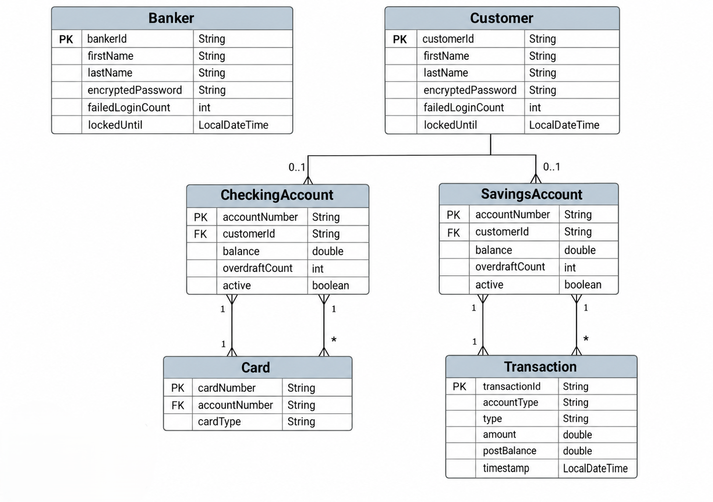

# ACME Bank - Java Banking System

## Technologies Used

- Java
- IntelliJ IDEA
- JUnit 5
- Java Collections
- Java File I/O
- Java Time API
- Java Optional
- Lambda Expressions
- SHA-256 Password Encryption
- GitHub
- Trello

---

## Trello

The project was planned using Trello to organize user stories, tasks, and development progress.

[View Trello Board](https://trello.com/invite/b/6aa0fd6d29b29a474c418f7e/ATTI39b1a906ae1865be06a6da4b84a1102eC84C4D17/bank-app)

---

## Additional Resources

Resources used during development:

- [LocalDate Class in Java](https://www.geeksforgeeks.org/java/java-time-localdate-class-in-java/)
- [SHA-256 Hashing in Java](https://stackoverflow.com/questions/5531455/how-to-hash-some-string-with-sha-256-in-java)
- [Exception Handling](https://www.geeksforgeeks.org/java/exceptions-in-java/)


---

## Planning and Development Process

The project was planned by first identifying the two main users of the system:

- Banker
- Customer

The requirements were then divided into smaller features such as:

- User login
- Customer creation
- Checking and Savings accounts
- Deposits
- Withdrawals
- Transfers
- Overdraft handling
- Mastercard limits
- Transaction history
- Transaction filtering
- Account statements
- Password encryption
- File handling
- Unit testing

The main classes were created first, including `User`, `Banker`, `Customer`, `Account`, and `Card`.

Inheritance and abstract classes were used to reduce repeated code. For example, `CheckingAccount` and `SavingsAccount` inherit from `Account`, while the different Mastercard types inherit from `Card`.

After the basic banking features were working, file handling was added to save Banker, Customer, account, and transaction information.

Additional features such as failed login protection, overdraft rules, Mastercard limits, transaction filters, and account statements were added afterward.

Unit tests were used throughout development to make sure the main features worked correctly.

### Problem-Solving Strategy

The project was developed one feature at a time.

When a problem occurred, I first identified which class or method was responsible. I then tested the feature separately before making changes.

One issue involved transfers being checked against both the transfer limit and withdrawal limit. This caused valid transfers to fail. The transfer logic was changed so that transfers use the correct transfer limit.

Another issue was that failed transfers could still use part of the daily card limit. This was fixed by checking the limit first and only recording the transfer amount after the transfer successfully completes.

Transaction filtering was also improved to support:

- Today
- Yesterday
- Last Week
- Last 7 Days
- Last Month
- Last 30 Days
- Custom Date Range

Unit tests were added to confirm that these changes worked correctly.

---

## Unresolved Issues / Future Improvements

The current version works for the project requirements, but some improvements could be added in future versions.

- Daily Mastercard counters reset when the program is restarted.
- Overdraft count and account active status could be saved permanently.
- Failed login lockout information could be saved between program restarts.
- `double` could be replaced with `BigDecimal` for more accurate financial calculations.
- More input validation could be added for customer IDs, names, passwords, and empty inputs.

---

## Favorite Functions

### `transferTo()`

One of my favorite functions is the `transferTo()` method in the `Account` class.

This method handles transfers between accounts.

Before completing a transfer, it checks:

- The transfer amount
- The sender's daily transfer limit
- The receiving account's daily deposit limit
- Whether the source account is allowed to complete the transaction

If the transfer succeeds, the money is removed from the source account and added to the destination account.

The card limits are only updated after the transfer succeeds, which prevents failed transfers from using part of the daily limit.

---


### Transaction Filtering

The `TransactionFilterService` is another part of the project I like.

It uses the `TransactionFilter` interface and lambda expressions to filter transactions by date.

This allows the same filtering method to be reused for different options such as Today, Last Week, Last Month, and Custom Date Range.

---

## ERD Diagram

The ERD below shows the main structure of the banking system.


```markdown

